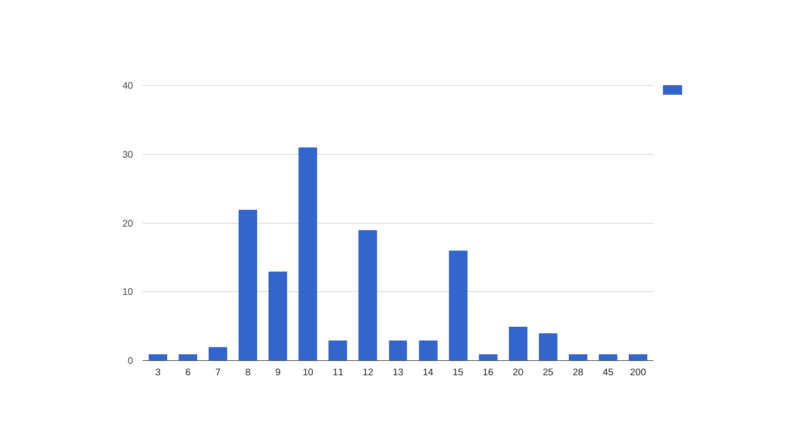
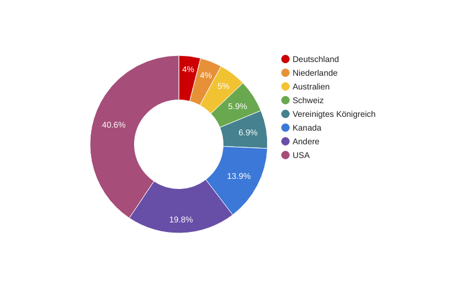
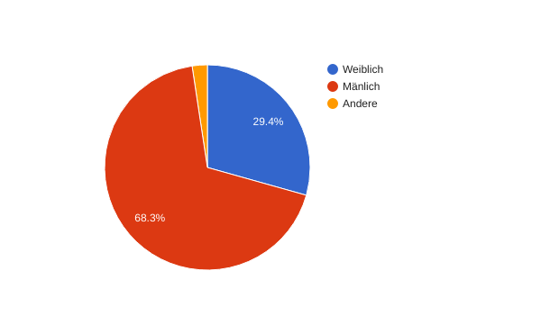

Zur Analyse, wie viele Menschen schon einen Passwort-Manager nutzen oder noch einen nötig hätten, haben wir eine kurze Umfrage durchgeführt. Diese haben wir im Internet veröffentlicht und innerhalb einer Woche ca. 130 Antworten erhalten.
# Fragen
Digitale Sicherheit

IdPA

Schär Marius
Buchs Jean-Rémy
Kaderli Severin

# Inhaltsverzeichnis

[[TOC]]

# Vorwort

"Wie sichern wir unsere digitale Idendität"

# Abstract

# Einleitung

# Hauptteil

# Umfrage

Zur Analyse, wie viele Menschen schon einen Passwort-Manager nutzen oder noch einen nötig hätten, haben wir eine kurze Umfrage durchgeführt. Diese haben wir im Internet veröffentlicht und innerhalb einer Woche ca. 130 Antworten erhalten. 

## Fragen

<table>
  <tr>
    <td>Please provide your gender</td>
    <td>Zur Einordnung der Teilnehmer.</td>
  </tr>
  <tr>
    <td>Age</td>
    <td>Zur Einordnung der Teilnehmer.</td>
  </tr>
  <tr>
    <td>Where are you from? (Continent)</td>
    <td>Zur Einordnung der Teilnehmer.</td>
  </tr>
  <tr>
    <td>Where are you from? (Country)</td>
    <td>Zur Einordnung der Teilnehmer.</td>
  </tr>
  <tr>
    <td>Which industry do you work in or is your field of study in?</td>
    <td>Zur Einordnung der Teilnehmer.</td>
  </tr>
  <tr>
    <td>Roughly how many hours per week do you use… [Any device at work, Desktop, Laptop, Tablet, Smartphone]</td>
    <td>Die Verbreitung der einzelnen Geräte hat einen Einfluss auf die wichtigste Zielgruppe eines Passwortmanagers.</td>
  </tr>
  <tr>
    <td>How do you secure your devices? [Any device at work, Desktop, Laptop, Mobile Device]</td>
    <td>Welche Alternativen zu Passwörtern werden eingesetzt?</td>
  </tr>
  <tr>
    <td>How many different services do you use?</td>
    <td>Wenn man pro Dienst ein eigenes Passwort einsetzen will, braucht man unter Umständen sehr viele Passwörter. </td>
  </tr>
  <tr>
    <td>How many different passwords do you use? </td>
    <td>Ein eigenes Passwort pro Service ist viel sicherer, aber fast nur mit einem Passwortmanager möglich.</td>
  </tr>
  <tr>
    <td>Which types of characters do your passwords have?</td>
    <td>Je mehr Arten der Zeichen (Zahlen, Grossbuchstaben, Kleinbuchstaben und Sonderzeichen) im Passwort enthalten sind, desto schwieriger sind Brute-Force-Angriffe.</td>
  </tr>
  <tr>
    <td>How many characters do your passwords have on average?</td>
    <td>Der Einsatz eines Passwortmanager führt häufig zu längeren Passwörtern. Längere Passwörter sind sicherer gegen Brute-Force-Angriffe.</td>
  </tr>
  <tr>
    <td>Do you use 2FA (eg. confirmation on your mobile)?</td>
    <td>Ist das Passwort der einzige Schutz des Kontos? Mit 2FA reicht die Kenntnis des Passwortes nicht für eine Anmeldung, ausser man hat gleichzeitig auch Zugriff auf das Smartphone / Hardware Token / etc. des Opfers.</td>
  </tr>
</table>

## Auswertung

### Passwortlänge

Die durchschnittliche Länge beträgt 11,6 Zeichen. Die Häufung bei acht Zeichen lässt sich durch die Anforderung der Mindestlänge vieler Dienste erklären. Bis etwa Passwörter mit zwölf Zeichen lassen sich gut merken. Die Häufungen bei 15 und 20 Zeichen könnte durch Standardeinstellungen der Passwortmanager erklärt werden.

### Länder

46% der Umfrageteilnehmer stammen aus den USA und Kanada, 11% aus dem deutschsprachigen Teil von Europa (Deutschland, Österreich und Schweiz), 23% aus dem restlichen Teil von Europa und 20% aus dem Rest der Welt.

### Geschlechtsaufteilung

### 

# Schlusswort

# Abkürzungsverzeichnis

# Literaturverzeichnis

# Anhang

# Authentizitätserklärung

